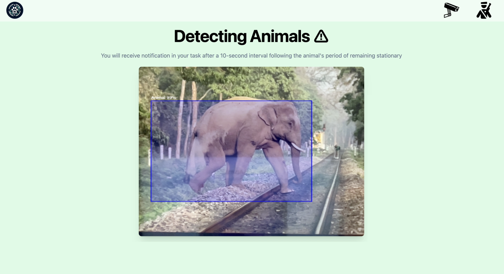

# AnimalG - Animal Detection Project for Railway Safety

  

## Overview
AnimalG is a project aimed at preventing railway accidents caused by animals on the tracks. It utilizes cutting-edge technologies including TypeScript, React, TensorFlow for animal detection, and Convex database and Convex file storage for efficient data management.

## How It Works
1. **Animal Detection**: Using TensorFlow, the system continuously scans the railway tracks for the presence of animals.
2. **Monitoring**: If an animal is detected, the system monitors its presence. If the animal remains on the tracks for too long, it indicates a potential danger.
3. **Noise Emission**: To deter animals from staying on the tracks, the system emits noise to chase them away.
4. **Notification**: If the noise emission fails to remove the animal, the system sends notifications to the local railway authorities and nearby wildlife centers for immediate action.

## Technologies Used
- **TypeScript**: Used for the backend logic to handle animal detection and notification mechanisms.
- **React**: Provides a user-friendly interface for monitoring and managing the system.
- **TensorFlow**: Utilized for real-time animal detection on the railway tracks.
- **Convex Database**: Stores essential data related to animal detection, notifications, and track monitoring.
- **Convex File Storage**: Stores images and other multimedia files related to animal detection for reference and analysis.

## Components
1. **Detection Module**: Responsible for real-time animal detection using TensorFlow models.
2. **Monitoring Interface**: Built with React, it provides a graphical interface for users to monitor the system's status and track animal activities.
3. **Notification System**: Manages the sending of notifications to railway authorities and wildlife centers in case of prolonged animal presence.
4. **Data Management**: Utilizes Convex database and Convex file storage for efficient data storage and retrieval.

## Benefits
- **Enhanced Safety**: Minimizes the risk of railway accidents caused by animals on the tracks.
- **Efficient Monitoring**: Provides real-time monitoring of animal activities on the railway.
- **GPS Integration**: Integrates GPS technology for precise location tracking of animal presence, enhancing the accuracy of notifications and response efforts.
- **Timely Response**: Enables prompt action through notifications to relevant authorities in case of prolonged animal presence.

